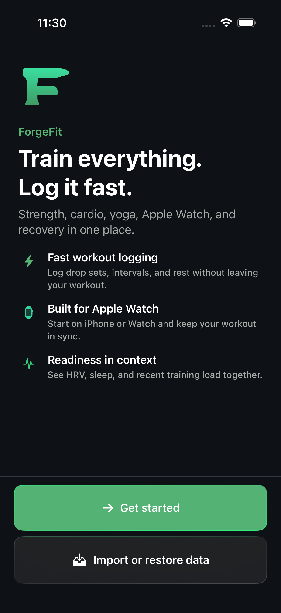
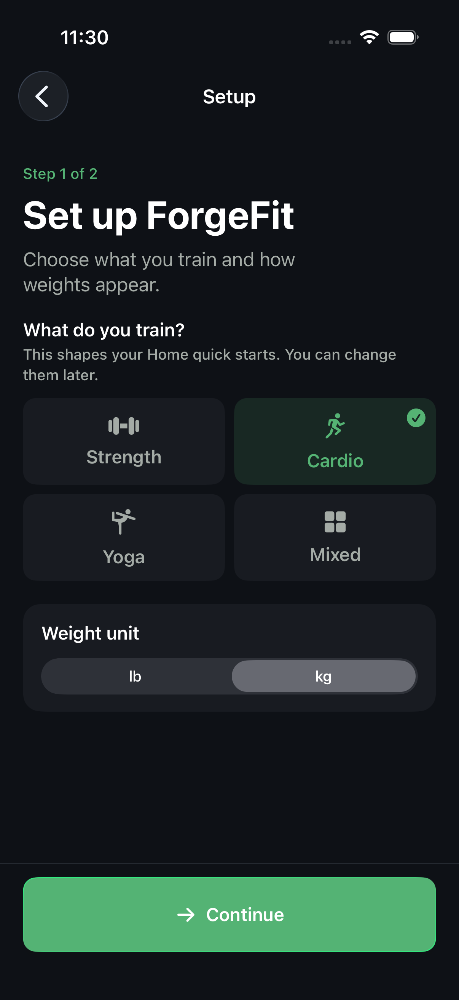
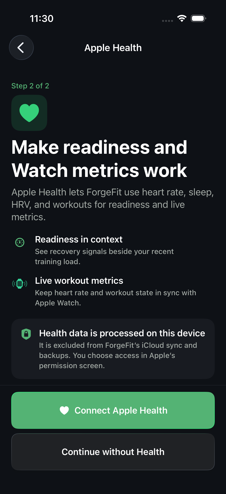
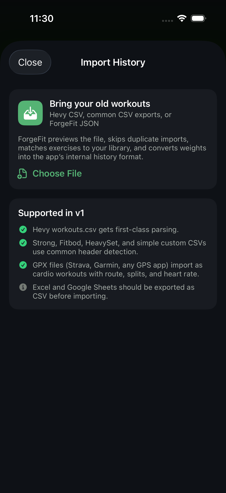

# ForgeFit 1.0 final release audit

Audit date: August 9, 2026  
Audited source: `0212e8533f9087973db365a5222bd4a8caf31de1` on `agent/liquid-glass-quick-action`; its file tree matches `origin/main`  
Release candidate inspected: ForgeFit 1.0 (50)  
Primary test device: iPhone 17 Pro simulator, iOS 26.5  

## Verdict

**Do not submit build 50 as the official 1.0 binary.** The product foundation is strong, the first-download experience is good, the core data and workout engines are heavily tested, and TestFlight use is meaningful evidence that the Production CloudKit schema works. The current candidate still has several release gates:

1. Build 50 was made with Xcode 27 beta 4. Apple currently permits those builds for TestFlight, while Xcode 26.6 builds are accepted for App Store distribution. Rebuild with the current stable App Store toolchain and upload as build 51.
2. The automatic iCloud Drive workout backup needs a product and policy decision before release. It is automatic despite being described as optional, has no visible status or off switch, contains detailed workout history and precise routes, and has not been restored end-to-end from the actual latest file into a clean installation.
3. The app's iCloud compliance claim is stronger than the evidence. Explicit Apple Health-derived fields are successfully excluded, but the iCloud Drive backup still contains fitness history and precise route points, while the CloudKit planning store includes exercise notes with a `painFlag`. Apple says apps may not store personal health information in iCloud. This is an approval/compliance ambiguity, not a finding of legal noncompliance, but it should not be waved through.
4. App Store Connect metadata was not available for live verification. A real support URL with contact information is required and none exists in the repository or current in-app policy. Privacy answers, age rating, medical-device declaration, export compliance, review notes, screenshots, availability, and trader status still need a final dashboard pass.
5. The complete UI suite is not green. Most failures are stale automation rather than observed product breakage, but the suite needs to be updated and rerun, and a reproducible invalid-frame warning around keyboard presentation should be fixed or consciously accepted.
6. The iPhone/Watch workout lifecycle still needs a physical-device release smoke test.

After those gates, I would be comfortable treating the next stable-toolchain binary as a serious v1 release candidate.

## Release dashboard

| Area | Result | Evidence and boundary |
|---|---|---|
| First download and onboarding | Green | Both onboarding UI tests passed on a brand-new simulator; Health is optional; import/restore is reachable and returns correctly. |
| Core/domain/data tests | Green | ForgeCore and ForgeData package suites passed. |
| App unit tests | Green | 762 of 762 passed, with no skips or runtime warnings. |
| Broad iPhone UI coverage | Yellow | The result reports 63 unique passed test cases / 64 passed device-configuration executions, 10 failed, and 2 skipped. Failures were classified below; nine layout warnings were emitted. |
| Fresh targeted UI rerun | Green with warning | 5 of 5 passed on a newly created simulator; one invalid-frame warning reproduced when focusing a Myo activation field. |
| Watch build | Green | Watch app and complication built successfully for a generic watchOS simulator target. |
| Physical iPhone + Watch lifecycle | Not verified | Build/simulator evidence does not prove WatchConnectivity transport, HealthKit delivery, haptics, routes, alarms, audio, BLE, or background behavior on hardware. |
| Production CloudKit schema | Green technically | Exported TestFlight binary uses the Production environment, and the developer plus TestFlight users have exercised it. A new-account/two-device smoke remains useful but is not a schema-deployment blocker. |
| iCloud Drive backup creation | Green | Two rotating backup files are present in the Mac's synced iCloud Drive container and both decode as schema v1 JSON. |
| Actual clean backup restore | Not verified | Mapper and restore tests pass, but the real latest file was not committed into a clean real database/device. |
| Privacy/compliance boundary | Red pending decision | Explicit Health fields are absent, but the automatic backup includes detailed fitness records/routes and CloudKit includes a pain flag. |
| Archive structure | Green | Four version-matched bundles, four dSYMs, four privacy manifests, valid signatures, and no third-party frameworks. |
| App Store binary eligibility | Red | Build 50 uses Xcode 27 beta 4 and must be replaced by a stable-toolchain build. |
| Store metadata/support | Red pending dashboard completion | Privacy URL is live; required support contact and the rest of the version metadata were not verified. |

## First-download experience

The first launch has a coherent, low-friction path:

1. Welcome: clear value proposition, visible **Get started**, and a visible **Import or restore** route for existing users.
2. Setup: strength/cardio/yoga/mixed training focus and lb/kg units, with a normal back control.
3. Apple Health: explains the value and on-device processing, offers **Connect Apple Health**, and preserves a clear **Continue without Health** path.
4. Training focus seeds quick starts only; it does not silently prescribe a program.
5. The first Home state offers **Find your program**, **Empty workout**, quick cardio/yoga entry points, and a reconnect path if Health was skipped.

The import/restore entry supports the latest or previous iCloud backup, Files, and supported history formats. It provides preview/matching/deduplication before commit and can re-enrich restored workouts from Apple Health on the new device.

The four screenshots below were captured on August 6. There is no onboarding-source diff between that capture revision and the audited source, and the clean-install onboarding flows were rerun successfully on August 9.

### Welcome

### Basic setup

### Apple Health choice

### Import or restore

### First-download audit notes

- The experience is polished, readable, and does not trap a user behind Apple Health permission.
- The Health copy correctly says Apple Health-derived data is excluded from ForgeFit's iCloud mechanisms. That narrower statement is supported by the emitted backup-key inspection.
- The root app and onboarding cover cap Dynamic Type at Accessibility 1. This protects dense logging layouts but means the largest accessibility text sizes are not supported. This is acceptable technical debt only if disclosed internally and tested deliberately; it should not be advertised as full Larger Text support.
- Backup behavior is not explained during first download. A new user signed into iCloud can receive automatic backup writes without seeing what was written, whether it succeeded, or how to disable it.

## Major user-flow audit

| Flow | Evidence | Assessment |
|---|---|---|
| App launch and navigation | Launch test, launch performance test, app-bar root-navigation test | Pass in simulator. |
| Onboarding with Health skipped | Broad UI pass and fresh-simulator targeted pass | Pass. |
| Import/restore entry and return | Broad UI pass and fresh-simulator targeted pass | Pass. Actual destructive restore of the developer's backup was intentionally not performed. |
| Empty workout and quick actions | Empty-workout picker plus nine quick-action tests | Pass. |
| Strength logging | Completed-exercise, quick increment, keyboard accessory, incomplete-set warning, rest timer, and live exercise replacement tests | Pass. |
| Myo/rest-pause entry | Dedicated Myo tests passed; the one broad-suite AX failure passed on the clean rerun | Functionally pass; keyboard layout warning remains. |
| Routine library/archive/reorder | Archive/restore and reordering tests passed | Pass. Several older editor tests use obsolete labels and need maintenance. |
| Conditioning/cardio | Conditioning preset, routine-cardio goal, quick-cardio recent, and cardio-history editing tests passed | Pass in simulator. |
| Yoga | Current code/unit coverage is substantial, but the old UI test enters through a removed selector | Manual clean UI smoke still required. |
| Workout completion | All three incomplete-set warning branches passed | Pass. |
| History/calendar | History search/pagination, calendar, recovery-ring summary, and sleep-history tests passed | Pass in simulator. |
| Recovery/Home analytics | Current-day cached scores passed; focused metric detail and disclosure tests passed | Pass for current design. Two tests still expect a metric grid when Health is unavailable, which is no longer the product behavior. |
| Insights/experiments | Insight builder suite and experiment management/results/comparison passed | Pass in simulator. |
| Coach/profile | No-plan state, VoiceOver identifiers, session-only chat, and trophy/profile flows passed | Pass. Dormant automation-only coach chat is not a shipping network feature. |
| Social/community | Production feature flag is off; automation hook has coverage | Correct release posture. Do not enable without moderation, terms, and a fresh privacy review. |
| Data reset | Local deletion is covered by implementation/tests | iCloud backup deletion is best-effort and can silently fail, contradicting the policy's unconditional wording. |
| Watch app | Simulator build and shared protocol/unit coverage | Physical lifecycle remains a release gate. |

## Automated-test detail

### Passed

- `make -e test` with the beta Xcode developer directory: all ForgeCore and ForgeData package tests passed.
- App unit result: **762 passed, 0 failed, 0 skipped**.
- Fresh targeted UI result: **5 passed, 0 failed, 0 skipped**.
- Watch simulator build: `** BUILD SUCCEEDED **`.

### Broad UI failures classified

The broad result contains 10 failed test cases, but they are not ten confirmed broken product flows:

- Six routine/yoga tests use removed entry labels such as **Add Exercise** or an older yoga-format selector. The current editor exposes **Add to Routine**. These tests need to be rewritten against current UI, then rerun.
- Two Home cache tests expect the old no-Health metric grid. The current product deliberately hides an unavailable recovery dashboard and shows training plus **Connect Health** instead.
- The Myo keyboard test hit a simulator accessibility scroll failure; it passed on the fresh simulator.
- The monthly Wrapped test was state-sensitive in the broad run; it passed on the fresh simulator.

Nine broad-run warnings and one fresh-run warning reported `Invalid frame dimension (negative or non-finite)`. They cluster when text fields summon the keyboard, including routine-name, weight, and Myo fields. The flows complete, but the fresh reproduction means this is a real layout defect rather than only polluted simulator state.

### Test debt found in the backup boundary

The backup test describes its allowed-key walk as exhaustive, but the maximally populated workout fixture leaves six valid optional fields nil and the workout allow-list omits them:

- `conditioningPlanSnapshotJSON`
- `conditioningProgressJSON`
- `conditioningResultJSON`
- `wholeSessionRPE`
- `wholeSessionRPERatedAt`
- `wholeSessionRPEProtocolVersion`

The actual backup contains some of these fields and decodes correctly. This gap does not indicate a Health-data leak; it means the claimed exhaustive structural guard is incomplete and could fail to review a future change reliably.

## What is currently in iCloud

There are two separate mechanisms. The TestFlight binary has the Production CloudKit entitlement and also uses a private iCloud Drive ubiquity container; they carry different data.

### 1. Private CloudKit planning store

The Production CloudKit store includes:

- exercise library entries and aliases;
- exercise notes, machine setup fields, and `painFlag`;
- routine folders, routines, alternating pairs, blocks, exercises, and set targets;
- interval presets and yoga flows;
- coaching focus/goal/experience, weekly cadence, session duration, equipment, preferred cardio, generated program, and week overrides;
- saved insight names and recipe definitions, but not the observations displayed by those insights;
- XP total/level and workout-XP event records, including workout identifiers and component JSON.

It does **not** contain the local workout/cardio/route/check-in/experiment/readiness models. The developer's and TestFlight users' successful use is strong evidence that the Production schema is deployed and functioning.

### 2. Automatic iCloud Drive training-log backup

Two files were found locally in the Mac's synced ubiquity container:

| Slot | Size | Modified |
|---|---:|---|
| `ForgeFit-Backup-latest.forgefitbackup` | 202,390 bytes | 2026-08-09 11:59:47 EDT |
| `ForgeFit-Backup-previous.forgefitbackup` | 201,112 bytes | 2026-08-09 11:26:03 EDT |

Both decode as ForgeFit backup schema 1 / app version 1.0. The latest contains, structurally:

- 308 workouts;
- 659 workout-exercise records;
- 1,588 set records;
- 7 workout blocks;
- 110 cardio sessions and 41 splits;
- 3,716 precise route points;
- 1 import batch, 1 microcycle tracking record, and 1 microcycle window;
- profile display name, random user identifier, onboarding/unit/theme/quick-action/training preferences, plate inventory, alarm/timer and yoga preferences.

It includes user-authored timestamps, titles, workout notes, exercise notes, reps, weights, duration, effort/RPE, conditioning/yoga plan/progress/result JSON, cardio details, outdoor coordinates, import provenance, and microcycle state.

An exact recursive key scan found **zero** instances of the prohibited Health-derived keys covered by the test boundary, including heart rate, calories/active energy, HealthKit workout UUID, readiness, sleep/check-ins, body weight, steps/floors, TSS, and sample-series keys. That is good evidence for what the current two files omit; it is not proof that every future field will remain safe.

The following remain local-only and are not present in this backup: experiments and custom entries, daily check-ins, wrapped reports, progression suggestions, stored recovery/readiness/Health metrics, and HR-zone configuration.

### When the backup writes

If iCloud Drive is available, ForgeFit schedules an automatic backup:

- 60 seconds after log data changes;
- 2 seconds after a live workout closes if data is pending;
- 12 seconds after foregrounding when work is pending;
- as a once-per-day launch catch-up.

Failure retains a dirty flag for a later trigger but does not present an error. There is no user-facing backup status, last-success date, **Back up now**, toggle, or delete control outside Reset/Files. Calling this behavior "optional" is therefore not self-evident.

### Compliance and trust assessment

Apple's [App Review Guideline 5.1.3(ii)](https://developer.apple.com/app-store/review/guidelines/) prohibits personal health information in iCloud. The [Apple Developer Program License Agreement](https://developer.apple.com/la/support/terms/apple-developer-program-license-agreement/) separately limits using iCloud/CloudKit for sensitive individually identifiable health information unless Apple expressly permits it.

ForgeFit has a technically thoughtful boundary: HealthKit-derived metrics stay local, actual backup bytes support that claim, and the plan/log stores are split. The remaining records are still highly personal fitness data, and precise routes plus a synced pain flag make an unconditional "5.1.3(ii)-compliant" claim unsafe without Apple's interpretation. This audit is not legal advice; it is a release-risk finding.

**Safest v1 option:** turn off the automatic iCloud Drive workout backup, keep the explicit user-directed export/import flow, remove or localize the synced pain field, and update the privacy copy. A user-directed export remains under the user's direct destination choice.

**If the backup is retained:** obtain written Apple clarification; add explicit setup/Settings disclosure and control; consider excluding exact routes and health-adjacent notes/effort fields; show last success/failure; offer **Back up now**, off, and delete; make reset deletion awaitable and report failure; and restore the actual latest backup into a clean device before submission.

## Archive, signing, and distribution

The inspected archive is `build/archives/ForgeFit-1.0-50.xcarchive`, created August 9 at 19:52 UTC and uploaded successfully to Apple at 19:54 UTC.

It contains four aligned 1.0 (50) bundles:

- `org.xpetsllc.ForgeFit`
- `org.xpetsllc.ForgeFit.Widgets`
- `org.xpetsllc.ForgeFit.watchkitapp`
- `org.xpetsllc.ForgeFit.watchkitapp.ForgeFitWatchComplication`

There are four matching dSYMs and four privacy manifests. Signature verification passed. The exported distribution payload uses App Store profiles, has `get-task-allow = false`, enables beta reports, uses the Production iCloud environment, and includes HealthKit. No third-party dynamic frameworks were found.

The archive identifies Xcode build `27A5228h` / Xcode 27 beta 4. Apple's current [App Store Connect release notes](https://developer.apple.com/help/app-store-connect/release-notes/) describe Xcode 27 beta 4 binaries as eligible for internal/external TestFlight and Xcode 26.6 binaries as eligible for the App Store. Build 50 is therefore useful TestFlight evidence but not the binary to submit for sale.

Only Xcode beta is installed on this Mac. Install the current stable accepted toolchain, build from a clean/tagged main revision, increment to build 51, rerun tests, archive, upload, then separately verify upload processing and build selection in App Store Connect.

## Privacy, security, and configuration

Positive findings:

- No embedded API keys or obvious secrets were found.
- No analytics, advertising, tracking, or third-party SDKs were found.
- Privacy manifests declare no tracking and include required-reason API declarations.
- Health, Bluetooth, location, and photo purpose strings are present.
- Local SwiftData storage is excluded from ordinary device backup; cross-device behavior is intentionally split.
- Community is disabled in the shipping configuration.
- The public privacy-policy URL is reachable, and the in-app policy mirrors the current design.
- Health permission is optional, and workout start paths do not reopen the full authorization flow after write access is settled.

Required corrections/checks:

- Rewrite the privacy policy's unconditional iCloud-compliance and reset-deletion claims to match the final implementation.
- Add a support page containing actual contact information. Apple says the required support URL must lead to contact information in its [platform version metadata requirements](https://developer.apple.com/help/app-store-connect/reference/app-information/platform-version-information/).
- Verify that the App Store privacy URL and answers exactly match the final binary. Apple requires a privacy URL and current data-handling answers in [App Store Connect](https://developer.apple.com/help/app-store-connect/manage-app-information/manage-app-privacy/).
- The README still labels ForgeFit an early build with foundations in progress. Update public-facing repository copy before using it for support/marketing trust.
- Do not claim full Larger Text support while the app caps Dynamic Type at Accessibility 1.

## App Store Connect checklist

The logged-in App Store Connect record could not be verified during this audit, so complete all of the following against build 51:

- processed build selected for version 1.0;
- app name, subtitle, description, keywords, category, copyright, and release mode;
- current iPhone screenshots with no alpha channel;
- privacy-policy URL and published privacy answers;
- support URL with actual email/address/phone as applicable;
- updated age-rating questionnaire, including the current social-capability questions;
- regulated-medical-device declaration (likely **No**, based on the current product, but answer in the dashboard);
- export-compliance answer;
- App Review notes explaining no login, optional Apple Health, Watch pairing, background audio/location/Bluetooth use, the final iCloud behavior, and Community being disabled;
- territories/price, agreements, tax/banking where applicable, and DSA trader status;
- manual release is the safer v1 setting so approval does not automatically publish an unobserved binary.

## Physical-device release smoke

Run this on the exact build 51 distribution candidate, ideally with a second iCloud account/device where practical:

1. Delete ForgeFit, reinstall, complete setup without Health, relaunch, and confirm Home/empty workout/history/settings.
2. Reset or reinstall, authorize Health selectively, deny one optional type, and confirm the app remains usable without repeated authorization prompts.
3. Create/edit/archive/restore a routine; start it from iPhone; log regular, warm-up, unilateral, Myo/rest-pause, AMRAP/structured, cardio, and yoga content; background/lock; trigger rest/interval audio; finish; verify history and Health.
4. Start a workout from Watch and from iPhone; verify bidirectional state, exercise changes, structured sets, haptics, backgrounding, completion, delayed reconnect, and duplicate prevention.
5. Verify outdoor location/route behavior and a Bluetooth heart-rate monitor if those capabilities will be marketed in 1.0.
6. Verify widgets, complication, Live Activity, and alarm behavior after installation and after relaunch.
7. If backup remains enabled, use **the actual latest iCloud file** to restore into an empty install, compare structural counts and representative records, relaunch, and confirm Apple Health re-enrichment. Then test backup-off/delete and Reset while offline and online.
8. Confirm build 51 is processed, selectable, and free of App Store Connect validation warnings before submission.

## Exact go/no-go checklist

Ship only when every item below is true:

- [ ] Automatic iCloud backup policy/content is resolved and privacy copy matches.
- [ ] Synced pain/health-adjacent data has been removed/localized or explicitly cleared with Apple.
- [ ] Real clean restore passes, if backup remains a v1 promise.
- [ ] Reset deletion no longer silently contradicts the policy.
- [ ] Backup allowed-key test covers every emitted optional field.
- [ ] Stable Xcode build 51 passes package, app-unit, and updated UI suites.
- [ ] Keyboard invalid-frame warning is fixed or documented as an accepted non-user-visible risk after device validation.
- [ ] Physical iPhone/Watch smoke passes on build 51.
- [ ] Support URL/contact exists and all App Store Connect metadata is verified.
- [ ] Build 51 upload is processed and selected; release is set to manual.

## Evidence retained

- `AppTests.xcresult` and `app-tests.log`
- `UITests.xcresult` and `ui-tests.log`
- `FreshTargetedUITests.xcresult` and `fresh-targeted-ui-tests.log`
- `watch-simulator-build.log`
- onboarding screenshots under `artifacts/onboarding/`

The audit created only untracked artifacts. It did not change product source. A test-created simulator was deleted after use. Two regenerable ForgeFit DerivedData directories were removed after disk space fell to approximately 101 MB; source, archives, runtimes, DeviceSupport, and retained test evidence were preserved.
